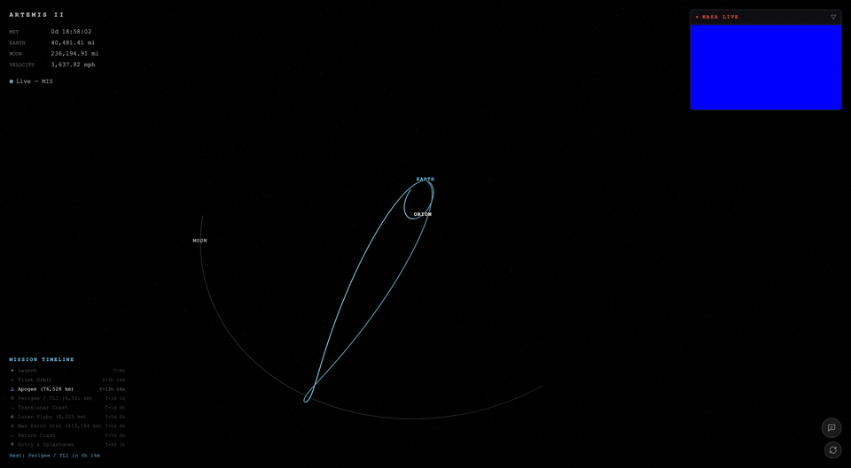
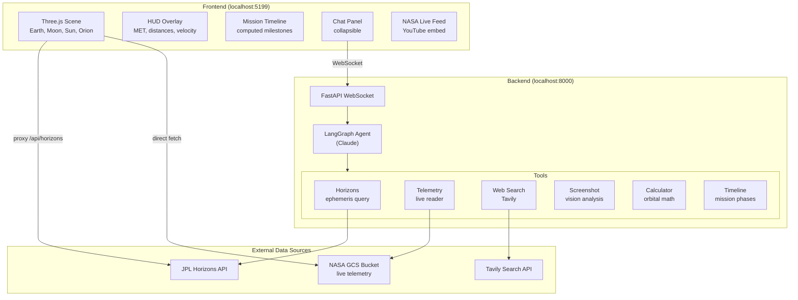
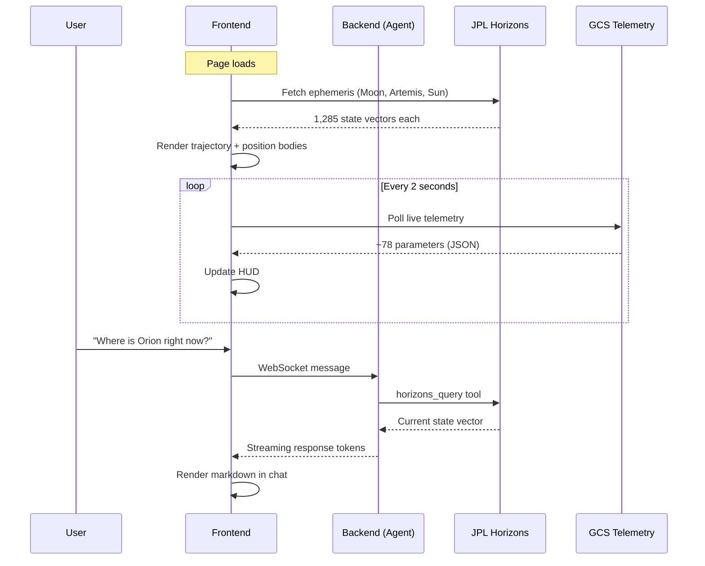
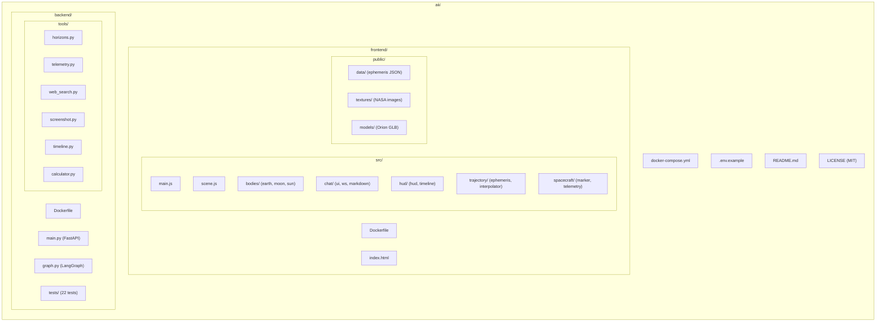

# aii

### Real-Time Artemis II Trajectory Viewer with AI Mission Assistant

An open-source, real-time 3D visualization of NASA's Artemis II crewed lunar flyby mission — built with Three.js, powered by JPL Horizons ephemeris data, live spacecraft telemetry, and an AI assistant that can answer questions about the mission as it happens.



---

## Features

- **Real-time 3D trajectory** — Earth, Moon, Sun, and Orion rendered in a fully interactive Three.js scene with true-scale positioning from JPL Horizons vectors
- **Live spacecraft tracking** — Orion's position updated every 2 seconds from NASA's public telemetry stream (Google Cloud Storage)
- **Full mission trajectory** — the complete 10-day Earth-to-Moon-and-back flight path drawn from 1,285 ephemeris data points
- **AI Mission Assistant** — a LangGraph agent (Claude) with tools to query ephemeris data, read live telemetry, search the web, analyze screenshots, and do orbital mechanics math
- **Computed mission timeline** — key milestones (apogee, TLI, lunar flyby, max distance, splashdown) derived automatically from actual trajectory data
- **NASA live feed** — embedded YouTube stream from NASA TV, collapsible
- **Accurate lighting** — the Sun's position is computed from real ephemeris, so Earth and Moon lighting/shadows are physically correct
- **True-scale Orion model** — NASA's official Orion capsule STL with procedural service module and solar panels, oriented along the velocity vector

## Architecture



### Data Flow



## Quick Start

### Docker (recommended)

```bash
# Clone the repo
git clone https://github.com/your-username/aii.git
cd aii

# Add your API keys
cp .env.example .env
# Edit .env with your ANTHROPIC_API_KEY and TAVILY_API_KEY

# Start everything
docker-compose up --build
```

Open http://localhost:5199 and explore the mission!

### Manual Setup

**Backend** (Python 3.12+):

```bash
cd backend
python -m venv venv
source venv/bin/activate  # or venv\Scripts\activate on Windows
pip install -r requirements.txt

# Add your API keys
cp ../.env.example .env
# Edit .env

uvicorn main:app --port 8000
```

**Frontend** (Node.js 22+):

```bash
cd frontend
npm install
npm run fetch-ephemeris  # pre-fetch trajectory data from JPL Horizons
npm run dev
```

Open http://localhost:5199

## Data Sources

| Source | What it provides | How it's used |
|--------|-----------------|---------------|
| **JPL Horizons** | Predicted trajectory vectors (position + velocity) for Artemis II, Moon, and Sun | Full trajectory line, spacecraft position, Moon position, Sun direction/lighting |
| **NASA GCS Telemetry** | Live telemetry (~78 parameters, updated every ~1 second) | Signal status indicator, raw parameter inspection by AI assistant |
| **NASA Blue Marble** | Earth texture (5400x2700 equirectangular) | Earth sphere rendering |
| **NASA LROC** | Moon texture (2048x1024 from Lunar Reconnaissance Orbiter) | Moon sphere rendering |
| **NASA 3D Resources** | Orion capsule STL model | 3D spacecraft model with procedural service module |

## AI Assistant Tools

The chat assistant has 7 tools:

| Tool | Description |
|------|-------------|
| `horizons_query` | Query JPL Horizons API for position/velocity of any body at any time |
| `read_telemetry` | Fetch summary of current live telemetry (position, velocity, MET) |
| `inspect_telemetry` | Full dump of all ~78 telemetry parameters, grouped by category |
| `mission_timeline` | Get computed milestones with real distances/speeds from ephemeris |
| `web_search` | Search the web for Artemis II news and orbital mechanics info |
| `analyze_screenshot` | Capture and analyze the current 3D view with Claude's vision |
| `calculate` | Evaluate math expressions with orbital mechanics constants |

## Project Structure



## API Keys

You need two API keys:

- **Anthropic** — for the Claude-powered AI assistant. Get one at [console.anthropic.com](https://console.anthropic.com/)
- **Tavily** — for the web search tool. Get one at [tavily.com](https://tavily.com/) (free tier available)

The app works without these keys — you just won't have the chat assistant.

## Mission Timeline (computed from ephemeris)

| Event | MET | Distance |
|-------|-----|----------|
| Launch | T+0 | — |
| High Orbit Apogee | T+13.4h | 76,528 km from Earth |
| Trans-Lunar Injection | T+25.2h | 6,581 km (perigee), 10.6 km/s |
| Lunar Flyby | T+120.4h (day 5) | 8,325 km from Moon |
| Max Earth Distance | T+120.6h | 413,184 km |
| Skip Reentry & Splashdown | T+217.4h (day 9) | Pacific Ocean |

*All values computed from actual JPL Horizons state vectors, not estimates.*

## Contributing

Contributions welcome! This project was built during the live Artemis II mission. Some ideas:

- Improve telemetry parameter labels (we're reverse-engineering from value patterns)
- Add more celestial bodies (other planets visible from Orion's position)
- Trajectory playback / time scrubber
- Earth atmosphere glow shader
- Mobile-responsive layout
- Production build with static file serving

## Acknowledgments

- **NASA** — for making mission data publicly available and inspiring humanity
- **JPL Horizons** — for the incredible ephemeris service
- **Three.js** — for making WebGL accessible
- **LangGraph** — for the agent framework
- **Anthropic Claude** — for powering the AI assistant

## Disclaimer

**This project is not affiliated with, endorsed by, or connected to NASA, JPL, or any government agency.** It is an independent, open-source educational project that uses publicly available data and APIs. Trajectory data comes from JPL Horizons (a public service), telemetry is read from a publicly accessible Google Cloud Storage bucket, and textures are from NASA's public domain media. The AI assistant may produce inaccurate information — always verify critical data against official NASA sources.

## License

MIT License. See [LICENSE](LICENSE) for details.

NASA imagery and data are in the public domain per [NASA Media Usage Guidelines](https://www.nasa.gov/nasa-brand-center/images-and-media/).
